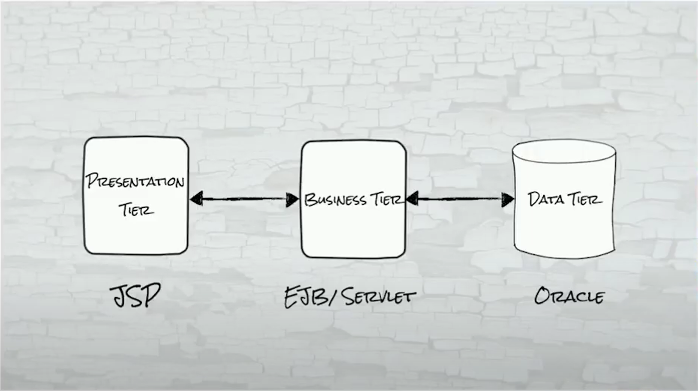
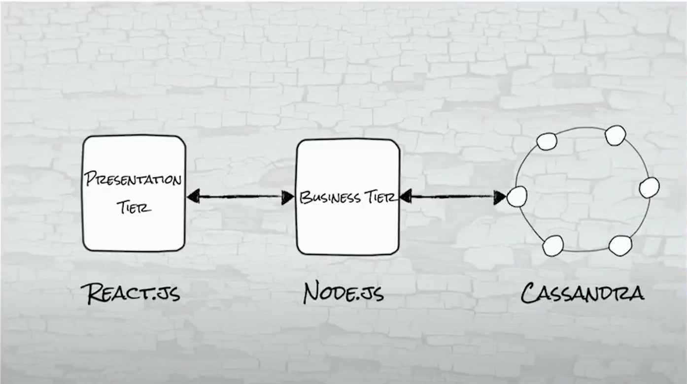
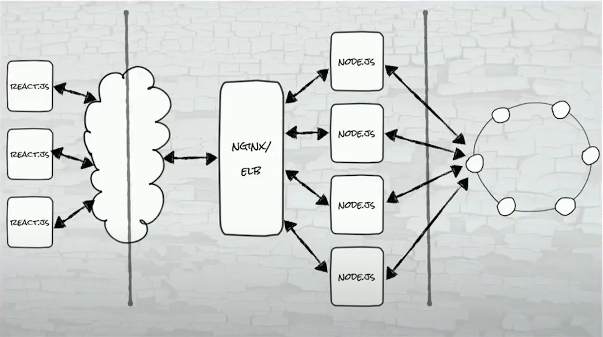
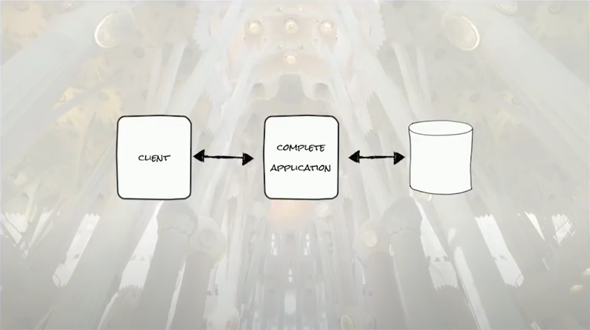
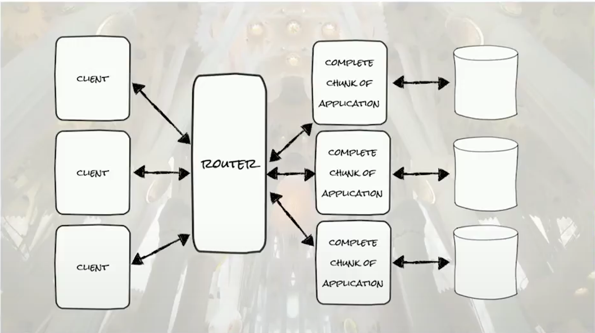
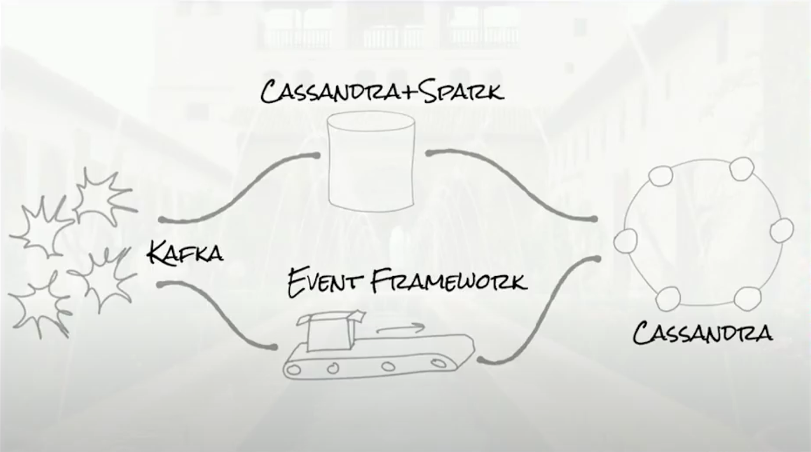
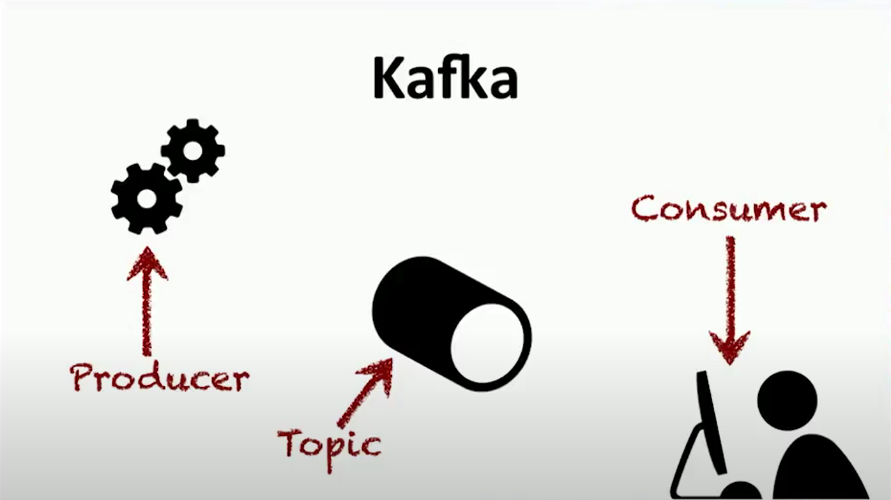
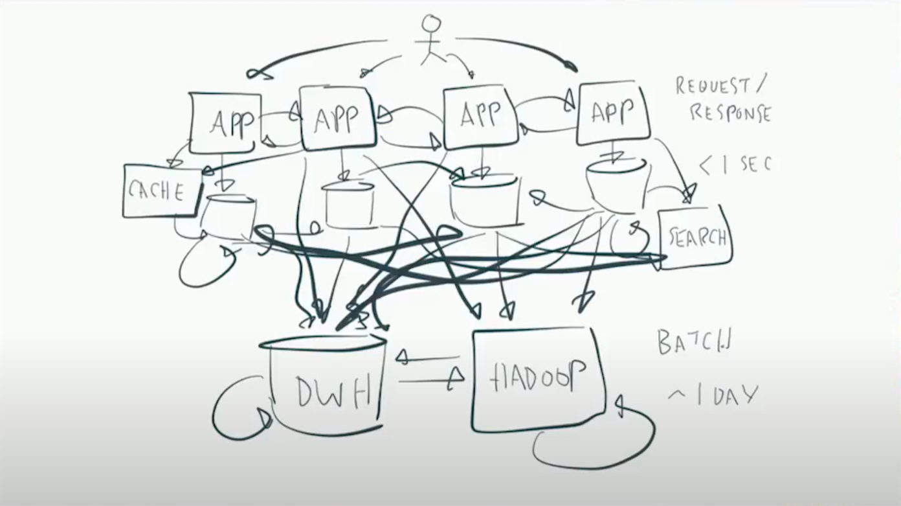
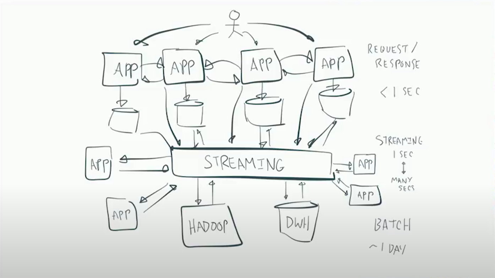
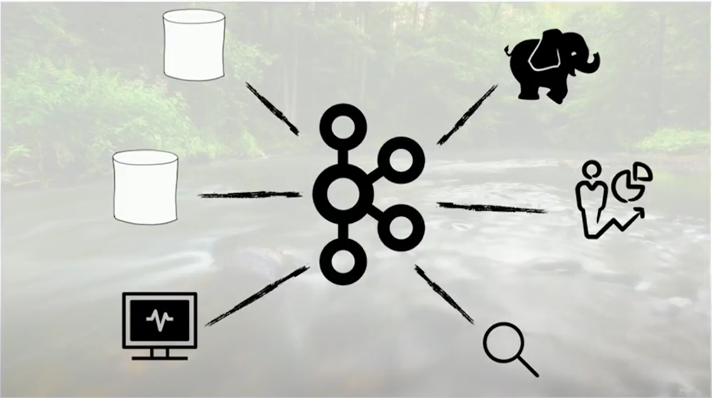

# Four Types of Distributed System Architectures:

These are notes taken from Tim Bergund's talk on distributed systems for Devoxx Poland in 2017, click below to watch:

## 0. Primitive Three Tier Architecture

|  |
| :------------------------------------------------: |
|          Primitive Three Tier Architecure          |

- Not a distributed system

## 1. Modern Three Tier Architecture [2:27](https://youtu.be/BO761Fj6HH8?t=147)

|  |
| :--------------------------------------------: |
|  |
|         Modern Three Tier Architecture         |

- Presentation Tier -> Business Tier -> Database
- Cassandra selects nodes based on the key (id) of the data through a hash function
- Strengths:
  - Rich front-end framework (scale, UX)
  - Hip scalable middle tier
  - Basically infinitely scalable data tier
- Weaknesses:
  - State in middle tier has to be stateless, otherwise it will create an impediment for scaling
- Rate (Out of 5):
  - Scalability: 4
    - As long as middle tier is stateless, this approach is very scalable
  - Hipness: 2
    - Not mature enough
  - Difficulty: 3
    - Easy to implement for all kinds of applications
  - Flexibility: 5
    - Clustering stateless backends is fully flexible

## 2. Sharded Architecture [16:49](https://youtu.be/BO761Fj6HH8?t=1009)

|  |
| :-----------------------------------------: |
|        Unscaled Sharded Architecture        |

|  |
| :-----------------------------------------------: |
|            Scaled Sharded Architecture            |

- Sharding scales by fully copying each pair of business and data tier on demand
- Similar to building applications for a single server (low distributed concerns)
- This creates the problem of Avignon Papacy (multiple master data nodes) problem if the network gets paritioned (some masters go offline)
- Requires a estimate of maxuimum shards even when dynamic sharding is possible

- Strengths:
  - Client isolation is easy
    (data and deployment)
    - Helps with data sovereignty laws
  - Known simple technologies
- Weaknesses:
  - Complexity
    - Complexity in the router
    - Distributed concerns in terms of monitoring and logging.
  - No comprehensive view of data
    - Will require an ETL process (Extract, Transform, and Load)
  - Oversized shards
    - Shard becomes its own conventional distributed system
    - Hence, it has to ensured that a shard will never become too large
- Rate (Out of 5):
  - Scalability: 3
    - As long as shards don't become too large, scaling works fine
  - Hipness: 1
  - Difficulty: 4
    - Analytics, ETL solutions
  - Flexibility: 3
    - Fairly flexible

## 3. Lambda [28:43](https://youtu.be/BO761Fj6HH8?t=1723)

|  |
| :--------------------------------: |
|        Lambda Architecture         |

- Not a general purpose architecture
- Makes distinction between streaming and batch data
- Batch data is stored somewhere (came to rest)
- Addressed by filename/offset/primary key in a table.
- Batch data is considered bounded
- Streaming data is a log of events
- Streaming data is unbounded
- Lamda assumes data is unbounded and immutable (cannot be changed)
- Real world events gets written to a long term storage (Cassandra + Spark) for high latency and bounded batch analysis (Example: business analysis, like what kinds of ads work)
- Events also gets written to a low latency, unbounded temporary queue (Event framework) (Example: real time data, tweet-notification)
- Data from Cassandra+Spark and Event-Framework gets written to a scalable database at the backend (Cassandra)
- Cassandra+Spark and Event-framework is optimized to do bounded and unbounded analysis repectively
- Strengths:
  - Optimized subsystems based on operational requirement
  - Good at unbounded data
- Weaknesses:
  - Complex to operate and maintain
  - Need to write almost same code twice once for each data system (Batch jobs and Stream analysis)
- Rate (Out of 5):
  - Scalability: 5
  - Hipness: 1
  - Difficulty: 5
  - Flexibility: 2
    - Not a general purpose framework, only for event analysis

### 3.1 Messaging (Kafka) [34:41](https://youtu.be/BO761Fj6HH8?t=2081)

|  |
| :-----------------: |

- Consists of Producer, Consumer, and Topic
- Topic: named queues of messages
- Producers put messages in topics and consumers take them out
- A Topic lives on a broker (server) running Kafka
- A Topic can be partitioned, as one Topic can become too big
- An oversized Topic has to be clustered, then it lives on more than one brokers
- Hence, in a partitioned Topic, a datum is hashed by its ID to select its partition. The ID could be account-id, ip address, sensor id etc.
- This breaks the natural ordering of queues as seen in a single-broker Topic
- Although partitions are ordered, the Topic is not (in a partitioned Topic)
-

## 4. Streaming [39:59](https://youtu.be/BO761Fj6HH8?si=5rltv7bh0Ne5URPW&t=2399)

|                |
| :--------------------------------------: |
| Messaging without Enterprise Service Bus |

|  |
| :------------------------: |
| Messaging with Service Bus |

|  |
| :--------------------------------------------------: |
|        Messaging with Streaming data (Kafka)         |

- Integration is a first class concern
  - System A needs to message System B
- Life is dynamic; databases are static
- Tables are streams and streams are tables
- Keep your services close, your computations closer
- Enterprise Service Bus is a solution with no clustering (equivalent to a single Topic) and a central message queue (Service Bus)
- Streaming/Kafka can cluster a Topic and can have multiple topics

### Additional Kafka Features:

- No need to write code for processing standard events due to Kafka connect
- High retention policy of 7 days by default and configurable
- O(1) writes as its a queue
- Partioning, replication
- Elastic scale
- The Streams API for Kafka is run within a service and not a cluster
- On It can do filters, aggregation, joins of stream
- Stream computations near code
- Rate (Out of 5):
  - Scalability: 5
  - Hipness: 5
    - Cutting edge technology
  - Difficulty: 4
    - Needs a lot of planning
  - Flexibility: 5
    - Any kind of system can be built
